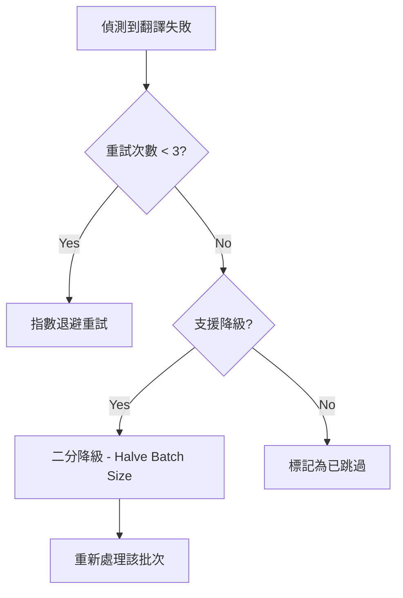

# 錯誤處理分類與重試 (Error Handling & Retry)

## 1. 錯誤處理分類

### 網路級錯誤 (Network Errors)
- **HTTP 429 (Too Many Requests)**: 觸發指數退避 (Exponential Backoff) 並降低併發。
- **Timeout**: 尤其在 Ollama 本機推理時常見，觸發自動暫停機制以保護系統。

### API 級錯誤 (API Errors)
- **Invalid API Key**: 提示使用者檢查設定。
- **Token Limit Exceeded**: 自動縮減該批次的字數或啟動二分降級。

## 2. 重試與降級邏輯

## 3. 異常防範機制 (Panic Prevention)
- **UTF-8 安全切片**: 嚴禁在未經校驗的情況下對字串進行 Raw Slicing。
## 4. 防禦性程式設計 (Defensive Programming)

### 路徑安全防護 (Path Safety Protection)
- **路徑規範化**：所有輸入與輸出路徑在處理前均執行 `canonicalize()`，消除 Windows 平台磁碟機代號大小寫差異與符號連結導致的 `strip_prefix` 失敗。
- **防止路徑溢出 (Path Escape Fix)**：在寫入檔案前強制將目標路徑轉換為相對路徑，防止絕對路徑置換基礎目錄，確保輸出的檔案絕對不會逃選出目標資源包目錄。

### 啟動前參數校驗 (Pre-flight Validation)
- 為避免無效的 AI 請求（例如未選模型卻啟動），系統在 UI 層級與 `actions` 層級皆設有檢查點。若非法參數嘗試啟動任務，系統會攔截請求、鎖定按鈕並在日誌終端顯示明確的警告資訊（如：`⚠️ 啟動失敗：目前服務商需要選取模型`）。
