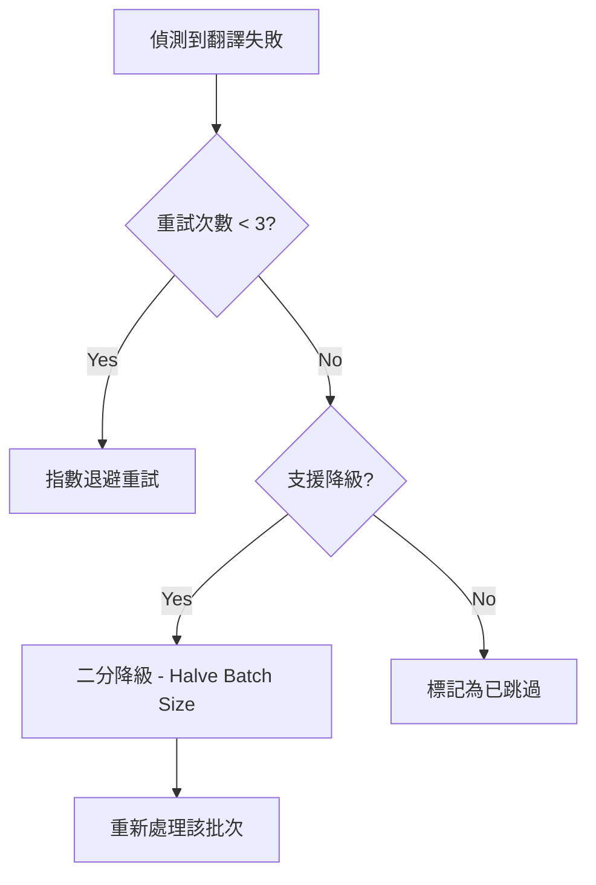

# 錯誤處理分類與重試 (Error Handling & Retry)

## 1. 錯誤處理分類

### 網路級錯誤 (Network Errors)
- **HTTP 429 (Too Many Requests)**: 觸發指數退避 (Exponential Backoff) 並降低併發。
- **Timeout**: 尤其在 Ollama 本機推理時常見，觸發自動暫停機制以保護系統。

### API 級錯誤 (API Errors)
- **Invalid API Key**: 提示使用者檢查設定。
- **Token Limit Exceeded**: 自動縮減該批次的字數或啟動二分降級。

## 2. 重試與降級邏輯

## 3. 異常防範機制 (Panic Prevention)
- **UTF-8 安全切片**: 嚴禁在未經校驗的情況下對字串進行 Raw Slicing。
- **Option/Result 處理**: 核心邏輯強制使用 `unwrap_or_default()` 或完整的 `match` 分支，防止執行緒意外崩潰導致 UI 鎖死。
