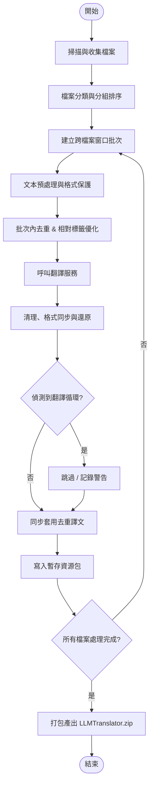
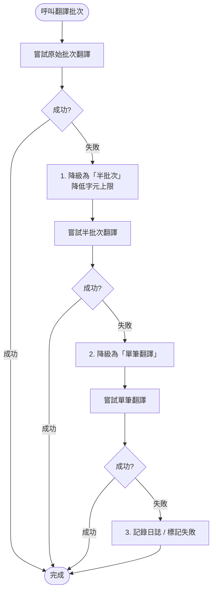
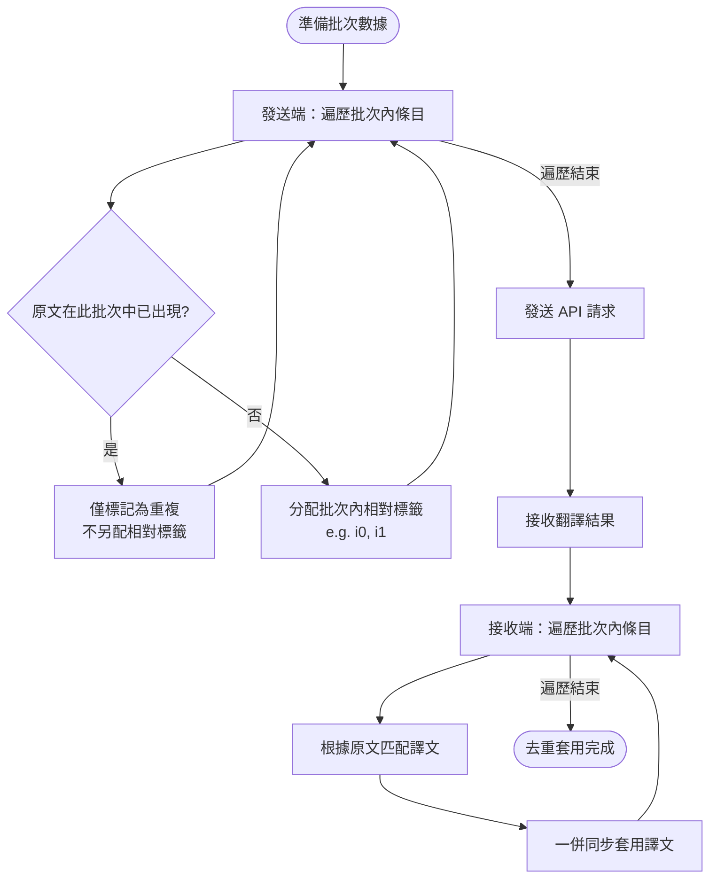
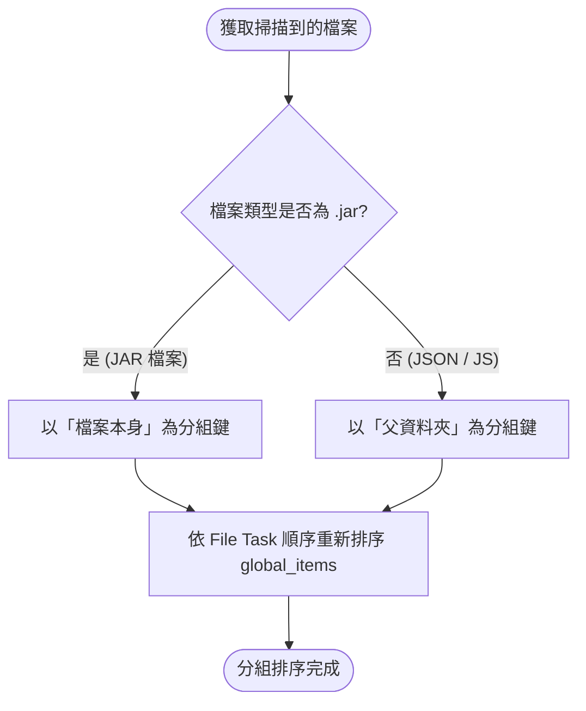
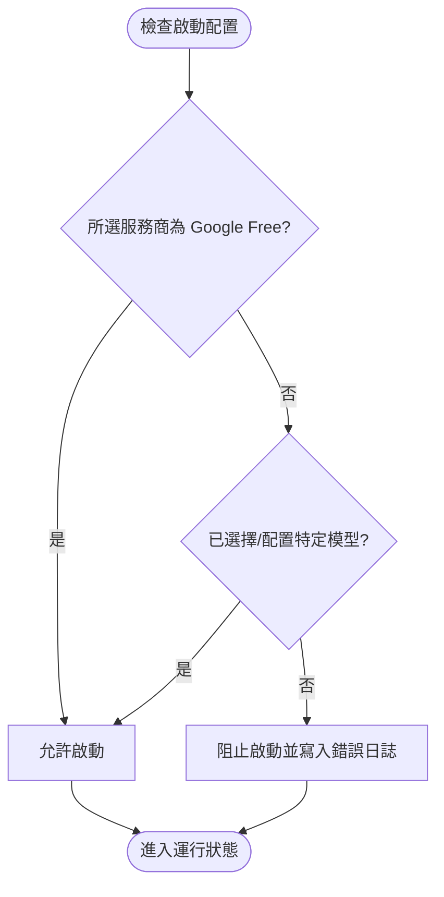
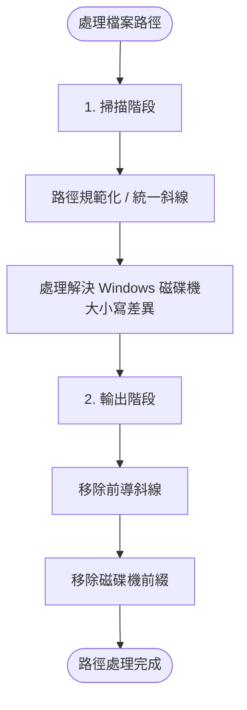

# 系統邏輯判斷 Mermaid 流程圖

以下根據系統文件（`translation_core.md`、`file_pipeline.md`、`error_handling.md`）整理出的核心邏輯判斷圖。

---

## 1. 翻譯主流程 (Main Translation Flow)

此流程涵蓋了從檔案掃描到最終打包的完整生命週期。

---

## 2. 批次降級與重試邏輯 (Batch Fallback & Retry)

當 API 呼叫失敗時，系統會自動縮減批次大小以提高成功率。

---

## 3. 批次內去重邏輯 (Intra-batch Deduplication)

在單一批次中，減少對 API 的重複請求並同步結果。

---

## 4. 檔案分組決策 (File Grouping Decision)

決定翻譯項目如何分組以建立批次窗口。

---

## 5. 啟動前模型檢查 (Startup Validation)

驗證配置是否允許啟動系統。

---

## 6. 路徑安全處理 (Path Security)

避免路徑跳脫或系統差異導致的錯誤。

