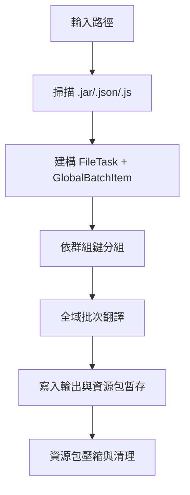
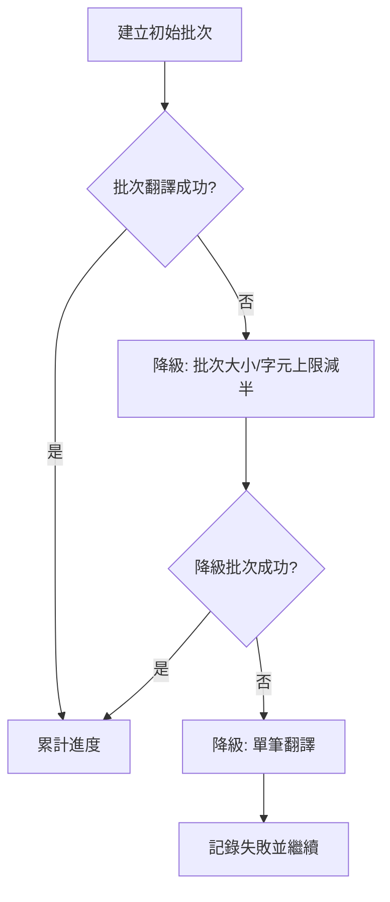
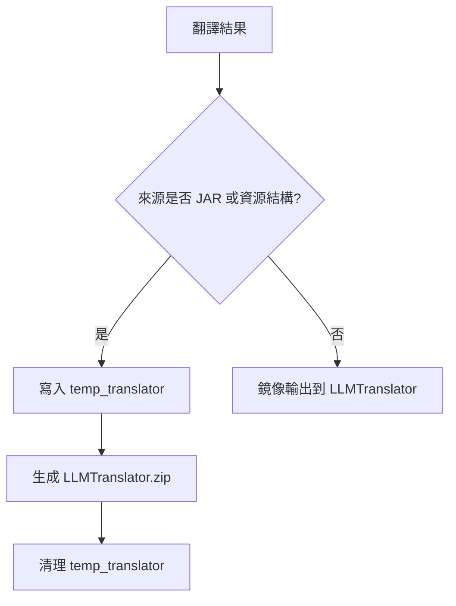

# 邏輯判斷流程圖

本文件以流程圖摘要翻譯主流程與批次降級邏輯。

## 全域翻譯管線

```mermaid
flowchart TD
    A[輸入路徑] --> B[掃描 .jar/.json/.js]
    B --> C[建構 FileTask + GlobalBatchItem]
    C --> D[依群組鍵分組]
    D --> E[全域批次翻譯]
    E --> F[寫入輸出與資源包暫存]
    F --> G[資源包壓縮與清理]
```

## 批次降級流程

```mermaid
flowchart TD
    A[建立初始批次] --> B{批次翻譯成功?}
    B -- 是 --> C[累計進度]
    B -- 否 --> D[降級: 批次大小/字元上限減半]
    D --> E{降級批次成功?}
    E -- 是 --> C
    E -- 否 --> F[降級: 單筆翻譯]
    F --> G[記錄失敗並繼續]
```

## 輸出分流

```mermaid
flowchart TD
    A[翻譯結果] --> B{來源是否 JAR 或資源結構?}
    B -- 是 --> C[寫入 temp_translator]
    B -- 否 --> D[鏡像輸出到 LLMTranslator]
    C --> E[生成 LLMTranslator.zip]
    E --> F[清理 temp_translator]
```
