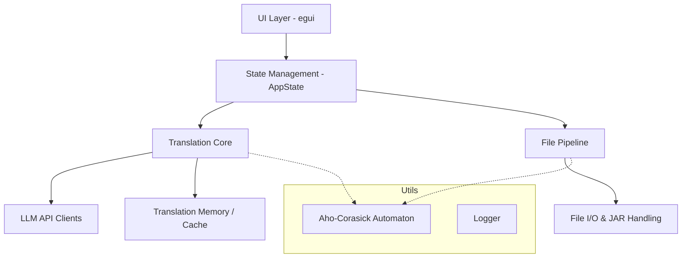
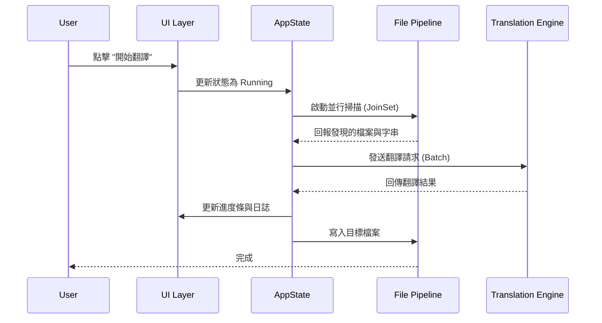

# 系統架構概覽 (System Architecture Overview)

## 1. 專案概覽 (Project Overview)
`mc_translator_rs` 是一個為 Minecraft 繁體中文在地化設計的自動翻譯工具，基於 Rust 開發並使用 `egui` 建立圖形介面 (GUI)。它能讀取 `mods` 資料夾中的 JAR 模組檔、資源包，或獨立的 JS/JSON，自動提取待翻譯字串，並利用多種線上/本機 LLM (Ollama, Gemini 等) 進行精準的在地化翻譯。

## 2. 核心架構圖 (Core Architecture)

## 3. 模組職責 (Module Responsibilities)

- **`src/ui/`**: 基於 `egui` 的 GUI 邏輯。
- **`src/state/`**: 共享的應用程式狀態（進度、暫停、取消）。定義了 `AppState`。
- **`src/translation/`**: 與 LLM 互動，處理自適應分批 (Adaptive Batching) 與翻譯邏輯。
- **`src/file/`**: 處理檔案解壓縮、JSON 掃描與 JS 腳本讀寫。
- **`src/utils/`**: 術語自動機 (Glossary Automaton)、日誌格式化等通用工具。

## 4. 執行流程 (Execution Flow)

