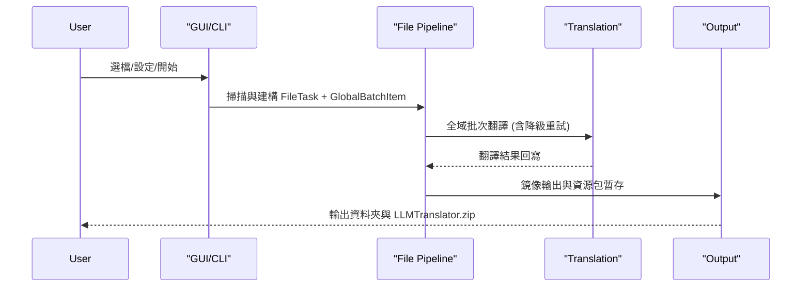

<!-- 最後更新: 2026-04-06 | 對應版本: v1.0.0 -->

<!-- 最後更新: 2026-04-06 | 對應版本: v1.0.0 -->

# 系統架構概覽

## 專案定位

`mc_translator` 是一個用於 Minecraft 模組與整合包在地化翻譯的工具，支援 GUI (Tauri) 與 CLI 兩種模式。
核心流程為: 掃描檔案 -> 擷取可翻譯字串 -> 呼叫翻譯服務 -> 輸出資源包或鏡像檔案。

## 核心模組

- [src-tauri/](/src-tauri/): Tauri 後端命令與視窗狀態管理
- [frontend/](/frontend/): GUI 前端 (HTML/CSS/JS)
- [src/cli/](/src/cli/): CLI 互動流程與 headless 參數模式
- [src/translation/](/src/translation/): 翻譯管線、批次降級、API 呼叫、術語系統
- [src/file/](/src/file/): 檔案掃描與 JAR/JSON/JS 處理、資源包輸出
- [src/config/](/src/config/): AppConfig 與 StyleConfig、字典檔案存取
- [src/utils/](/src/utils/): 跳過規則、文字前後處理、日誌工具

## 執行流程

## 主要資料結構

- `JobConfig`: 單次翻譯任務的快照設定
- `JobSharedState`: 共享狀態與進度控制
- `FileTask`: 單一檔案的翻譯任務
- `GlobalBatchItem`: 全域批次翻譯項目

## 輸出邏輯摘要

- 輸出根目錄固定為 `LLMTranslator/`
- 只有 JAR 來源或原本在 `assets/` 或 `patchouli_books/` 的 JSON 會進入資源包暫存
- 非資源結構 JSON 與 JS 直接鏡像輸出
- 資源包輸出完成後產生 `LLMTranslator.zip` 並清理暫存目錄

## 相關文件

- 邏輯流程圖: [docs/architecture/logic_diagrams.md](/docs/architecture/logic_diagrams.md)
- 狀態管理: [docs/architecture/state_management.md](/docs/architecture/state_management.md)
- 錯誤處理: [docs/architecture/error_handling.md](/docs/architecture/error_handling.md)
