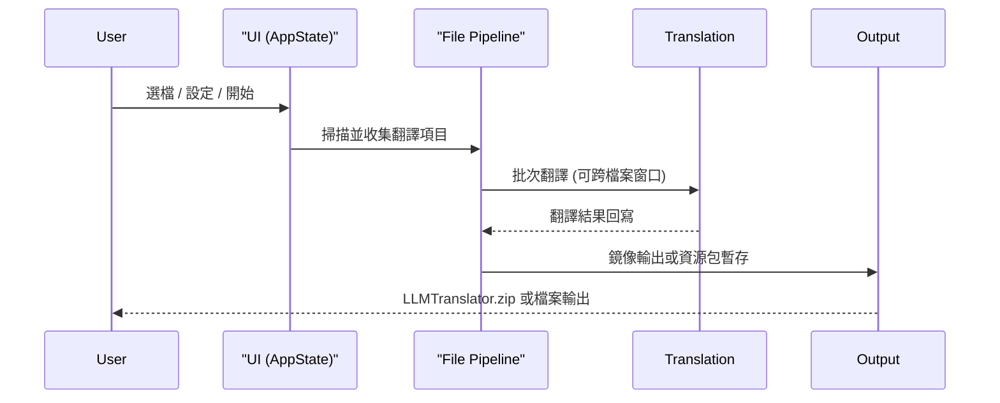

# 系統架構概覽

## 專案定位

`mc_translator` 是一個用於 Minecraft 模組與整合包在地化翻譯的工具，同時支援 **Windows GUI** 與 **純命令列 CLI** 操作。核心流程是：掃描檔案 -> 擷取可翻譯字串 -> 呼叫翻譯服務 -> 輸出資源包或鏡像檔案。

## 核心模組

- `src-tauri/`：Tauri 後端與前端互動
- `src/cli/`：CLI 介面與互動選單設計 (dialoguer, clap)
- `src/translation/`：共享狀態控制 (`job.rs`)、LLM 介接、術語提示，以及共通管線控制 (`pipeline.rs`)
- `src/file/`：檔案掃描、JAR/JSON/JS 處理、輸出封裝
- `src/config/`：設定檔與字典存取
- `src/utils/`：文字處理、跳過規則、日誌輔助

## 執行流程

## 主要資料結構

- `JobConfig`：單次翻譯任務設定
- `JobSharedState`：跨執行緒共享狀態
- `FileTask`：單一檔案的翻譯任務
- `GlobalBatchItem`：全域批次條目

## 輸出邏輯摘要

- 輸出根目錄固定為 `LLMTranslator/`。
- 只有 JAR 來源或原本在資源結構內的 JSON 會進入資源包壓縮流程。
- 非資源結構 JSON 與 JS 直接以原相對路徑輸出實體檔案。

## 邏輯判斷與流程圖

詳細的核心邏輯判斷圖（如翻譯主流程、批次降級、去重、分組等）請參閱 [邏輯判斷流程圖](./logic_diagrams.md)。

