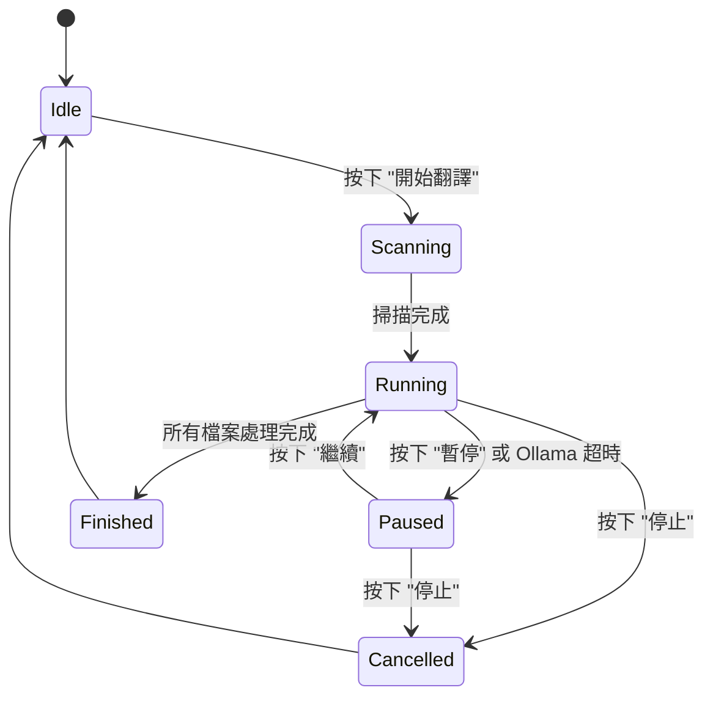

# 狀態管理 (State Management)

## 1. AppState 核心結構
`AppState` 是本專案的核心狀態容器，負責管理 UI 渲染、背景任務通訊及設定持久化。

### 狀態變數
- `is_processing`: 布林值，指示翻譯任務是否正在運行。
- `is_paused`: 布林值，指示當前任務是否處於暫停狀態。
- `is_cancelled`: 布林值，用於通知背景執行緒停止工作。

## 2. 非同步任務狀態圖

## 3. 跨執行緒同步機制
- **MPSC Channel**: 主視窗透過 `tokio::sync::mpsc` 接收來自背景任務的進度更新與日誌。
- **Atomic Flags**: 使用 `AtomicBool` 進行即時的暫停與取消信號傳遞，確保無鎖高性能通訊。

## 4. 視窗與設定持久化 (Persistence)
- **幾何同步 (Geometry Sync)**：
    - 主視窗與建議詞管理器視窗在每幀 `update()` 期間會自動同步至 `AppState`。
    - **同步閾值 (Drift Protection)**：為了防止 Windows 系統在處理邊框、陰影或高 DPI 時產生的座標抖動，系統設有 `5.0` 像素的同步閾值。只有當座標位移超過此值時才會更新狀態，有效解決了視窗位置「自動飄移」的問題。
    - **內外尺寸對齊**：主視窗持久化已對齊為儲存「內容區域尺寸 (Inner Size)」，確保載入與還原時的幾何一致性。
- **即時存檔 (Immediate Save)**：當使用者在 UI 上更動任何設定項（如主題、API 服務商、優先級、`user_prompt` 或 `system_prompt`）或視窗幾何變更時，會立即觸發 `save_config()` 將 `AppState` 狀態寫入 `config.cfg` 與 `.env`。
- **配置優化 (Config Optimization)**：`config.cfg` 採用繁體中文鍵名並按邏輯分組。核心提示詞欄位更名為 `user_prompt` 與 `system_prompt` 以符合 LLM 標準。
- **安全隔離 (Security)**：`api_key` 使用 `#[serde(skip)]` 標記，僅在 `.env` 中透過 `save()` 顯式存檔，嚴禁存入公眾可讀的 `config.cfg`。
- **狀態例外 (Persistence Exclusion)**：為了確保介面精簡，建議詞管理器的「開啟狀態」不予記憶，每次啟動時強制預設為關閉。
- **幾何引導 (Window Guidance)**：子視窗開啟初期（前 30-40 幀）會由主執行緒強制引導至最後儲存的座標。關閉視窗時會重置計數器，確保下次開啟時引導邏輯能再次生效。
- **最後存檔鉤子 (Exit Hook)**：實作了 `eframe::App::on_exit` 鉤子，在程式視窗被關閉時強制執行一次全域存檔，確保所有變更被正確保存。
- **任務啟動同步與驗證 (Startup Sync & Validation)**：
    - 在背景翻譯任務正式啟動前，`AppState` 會強制執行 `save_config()`，確保 UI 上的手動變更（如輸出資料夾路徑）在任務讀取設定前已確實持久化。
    - **嚴格模型校驗**：系統實現了 UI 與邏輯層的雙重校驗。除選取「Google Free」外，若 `selected_model` 為空，則「開始翻譯」按鈕將被鎖定，且邏輯層會攔截啟動請求並記錄警告日誌。
