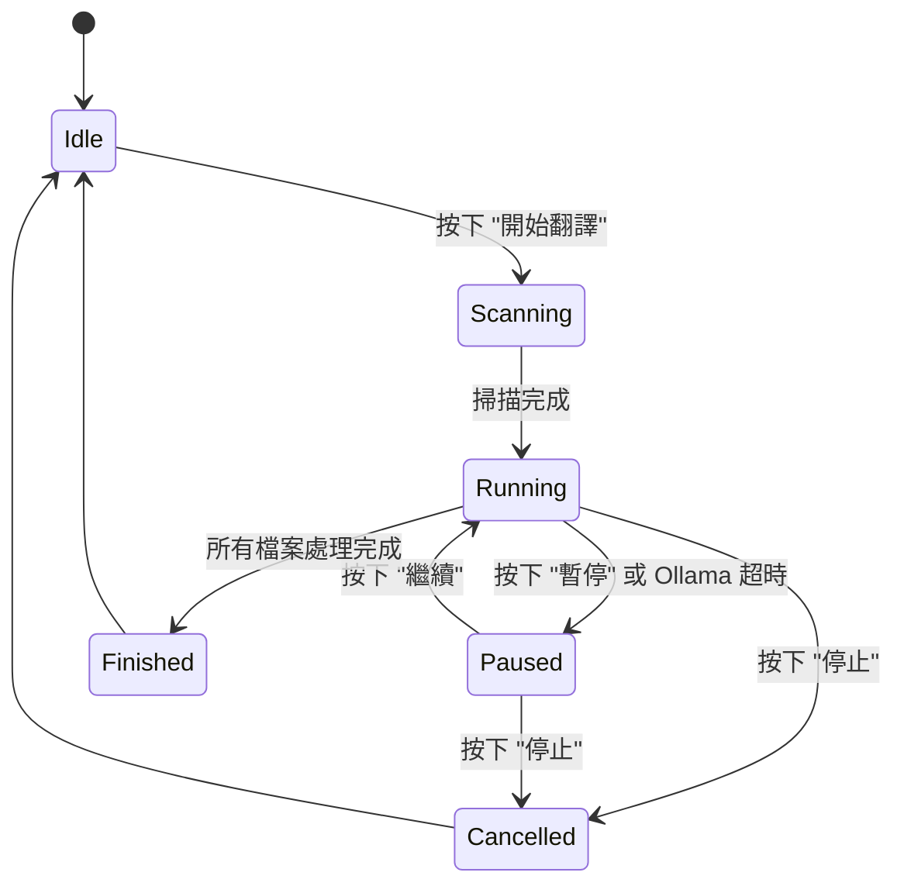

# 狀態管理 (State Management)

## 1. AppState 核心結構
`AppState` 是本專案的核心狀態容器，負責管理 UI 渲染、背景任務通訊及設定持久化。

### 狀態變數
- `is_processing`: 布林值，指示翻譯任務是否正在運行。
- `is_paused`: 布林值，指示當前任務是否處於暫停狀態。
- `is_cancelled`: 布林值，用於通知背景執行緒停止工作。

## 2. 非同步任務狀態圖

## 3. 跨執行緒同步機制
- **MPSC Channel**: 主視窗透過 `tokio::sync::mpsc` 接收來自背景任務的進度更新與日誌。
- **Atomic Flags**: 使用 `AtomicBool` 進行即時的暫停與取消信號傳遞，確保無鎖高性能通訊。

## 4. 視窗與設定持久化 (Persistence)
- **幾何同步 (Geometry Sync)**: 主視窗與建議詞管理器視窗的座標、高度、寬度在每幀 `update()` 期間會自動同步至 `AppState`。
- **即時存檔 (Immediate Save)**: 當使用者在 UI 上更動任何設定項（如主題、API 服務商、跳過檔案類型）時，會立即觸發 `save_config()` 將 `AppState` 狀態寫入 `config.cfg` 與 `.env`。
- **安全隔離 (Security)**: `api_key` 使用 `#[serde(skip)]` 標記，僅在 `.env` 中透過 `save()` 顯式存檔，嚴禁存入公眾可讀的 `config.cfg`。
- **最後存檔鉤子 (Exit Hook)**: 實作了 `eframe::App::on_exit` 鉤子，在程式視窗被關閉時強制執行一次全域存檔，確保視窗位置與最後變更被正確保存。
