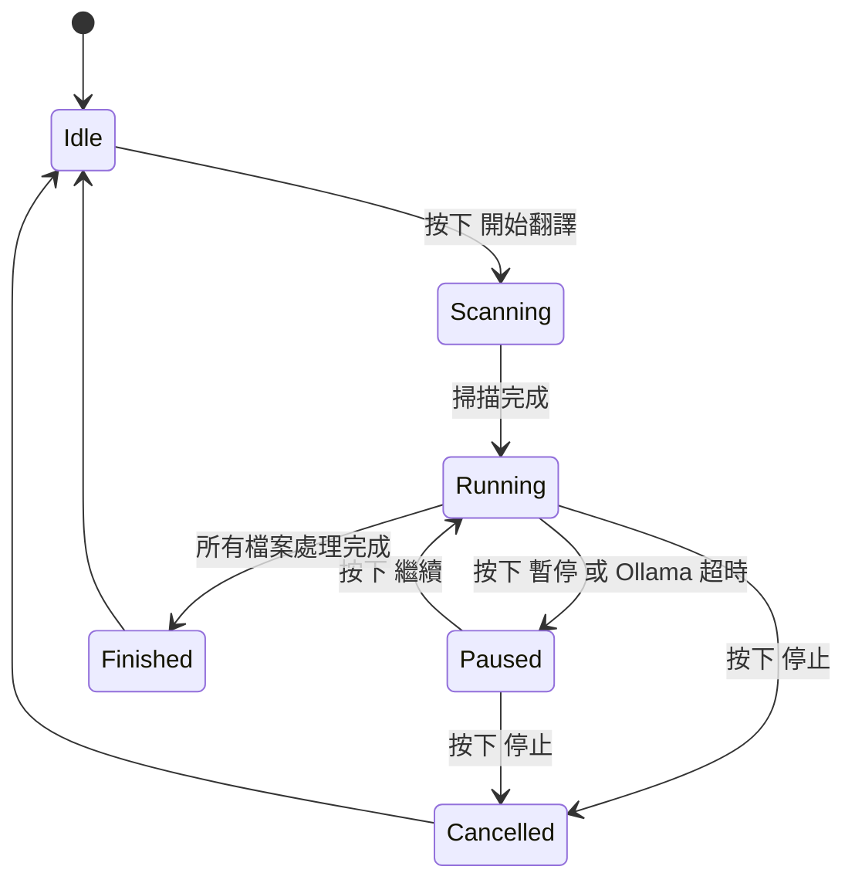

# 狀態管理 (State Management)

## 1. AppState 核心結構
`AppState` 是本專案的核心狀態容器，負責管理 UI 渲染、背景任務通訊及設定持久化。

### 狀態變數
- `is_processing`: 布林值，指示翻譯任務是否正在運行。
- `is_paused`: 布林值，指示當前任務是否處於暫停狀態。
- `is_cancelled`: 布林值，用於通知背景執行緒停止工作。

## 2. 非同步任務狀態圖

## 3. 跨執行緒同步機制
- **MPSC Channel**: 主視窗透過 `tokio::sync::mpsc` 接收來自背景任務的進度更新與日誌。
- **Atomic Flags**: 使用 `AtomicBool` 進行即時的暫停與取消信號傳遞，確保無鎖高性能通訊。
