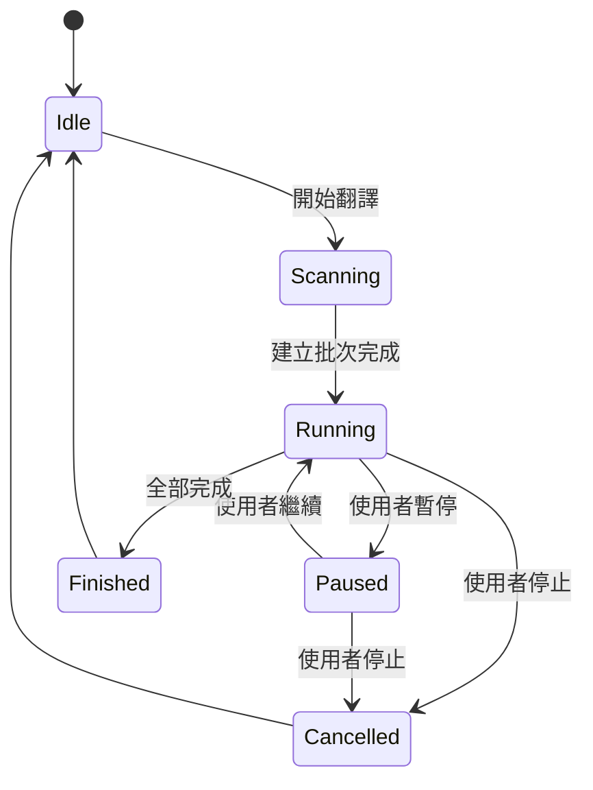
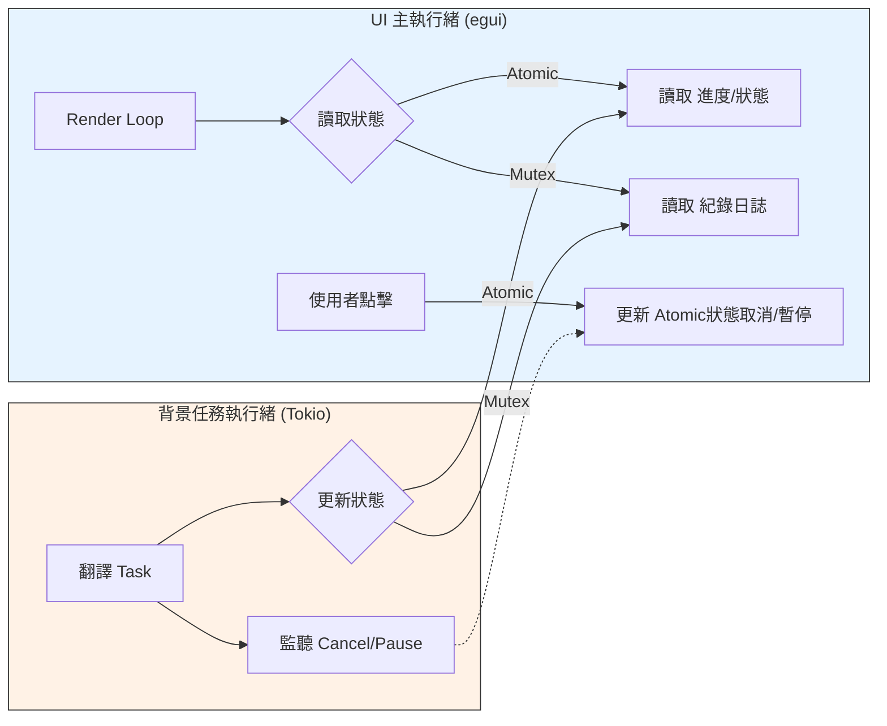

# 狀態管理

## AppState 結構

`AppState` 是 UI 與背景任務的核心狀態容器，保存翻譯流程、UI 控制、設定與字典管理器狀態。

**主要狀態來源**
- 原子狀態：`is_processing`、`is_paused`、`is_cancelled`、進度數值
- 互斥狀態：日誌、狀態文字、目前處理路徑
- 設定鏡像：API 參數、批次參數、主題、視窗位置

## 任務狀態流程

## 執行緒同步與資料流模型

以下說明「UI 主執行緒」與「背景任務執行緒」如何透過 `Arc<Mutex>` 與 `Atomic` 變數安全地共享與同步狀態。

## 同步與併發

- `AtomicBool/AtomicU32` 供 UI 即時讀取。
- `Arc<Mutex<...>>` 用於跨執行緒共享字串與日誌。
- 任務透過 `runtime.spawn` 執行，避免阻塞 UI。
- I/O 與重度工作使用 `spawn_blocking` 包裹。

## 持久化策略

- `config.cfg` 儲存主要設定。
- `.env` 儲存 `API_KEY`，並以 DPAPI 加密。
- 主視窗與字典管理器視窗會在幾何變動時即時同步並儲存。
- `on_exit` 會觸發保存，避免異常關閉時遺失設定。

## 模型與啟動檢查

- 除 `Google Free` 外，未選模型會阻止啟動並寫入日誌。
- 服務商切換時會清空目前模型並重新載入清單。

