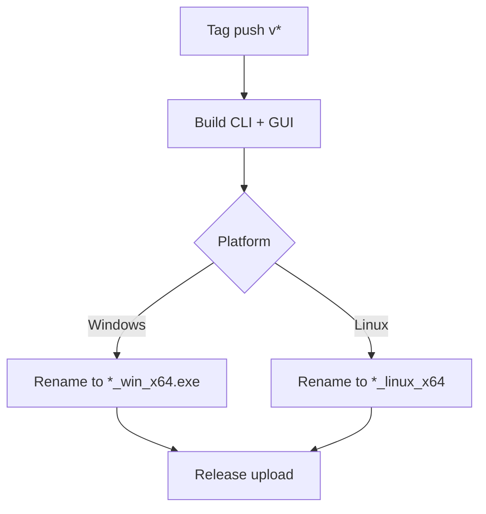

# Release / Artifacts

本文件整理 CI 發行流程的產物命名與對應平台。

## 產物命名

- Windows CLI: `mc_translator_cli_win_x64.exe`
- Linux CLI: `mc_translator_cli_linux_x64`
- Windows GUI: `mc_translator_gui_win_x64.exe`
- Linux GUI: `mc_translator_gui_linux_x64`

## 觸發條件

- [ci.yml](/.github/workflows/ci.yml) 在 tag 以 `v*` 開頭時會進行 build 與 release

## 流程圖

## 參考連結

- CI Workflow: [ci.yml](../../.github/workflows/ci.yml)
