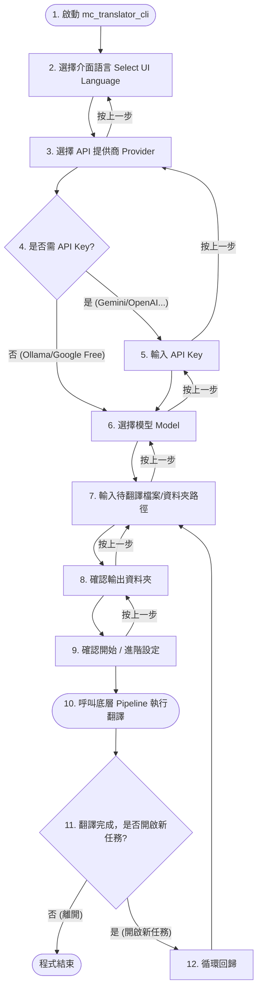

# CLI 使用者操作流程 (User Flow)

本文件展現 `mc_translator_cli` 的互動式操作生命週期與導覽支援。

## 流程圖

> [!TIP]
> **導覽連動規則**：
> - 在各步驟按下 **上一步** 會穩定依照歷史歷程退至前一個實質節點（絕不重複來回）。
> - 開啟新任務時，會保留前置 Provider/Model 狀態，直接從 **Step 5 (輸入檔案)** 恢復詢問。若在此時退回，將順暢連接至 **Step 4 (模型)**。
