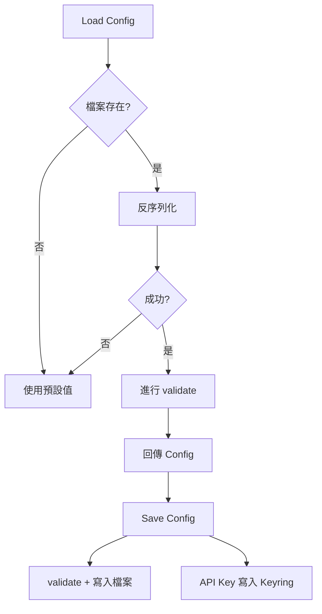

# 設定系統

本文件說明 AppConfig 與 StyleConfig 的載入、預設值與儲存位置。

## AppConfig

- 檔案: `settings/config.cfg`
- 主要欄位: 提供商、模型、批次量、語言、輸出路徑、開發者選項
- `api_key` 不會寫入檔案，改由 OS Keyring 儲存
- `api_base_url` 可用於 OpenAI 相容端點 (僅能手動修改 config.cfg)

## StyleConfig

- 檔案: `settings/style.cfg`
- 內容包含主題、字體大小、調色盤、間距與進度條樣式
- 支援特定元件覆寫 `instance_overrides`

## 讀寫流程

- [AppConfig::load](AppConfig::load) 與 `StyleConfig::load` 會建立 `settings/` 目錄
- 讀取失敗會回退到預設值
- 儲存時會先進行 `validate` 驗證

## 流程圖

## 相關檔案

- [src/config/settings.rs](/src/config/settings.rs)
- [src/config/dictionary.rs](/src/config/dictionary.rs)
