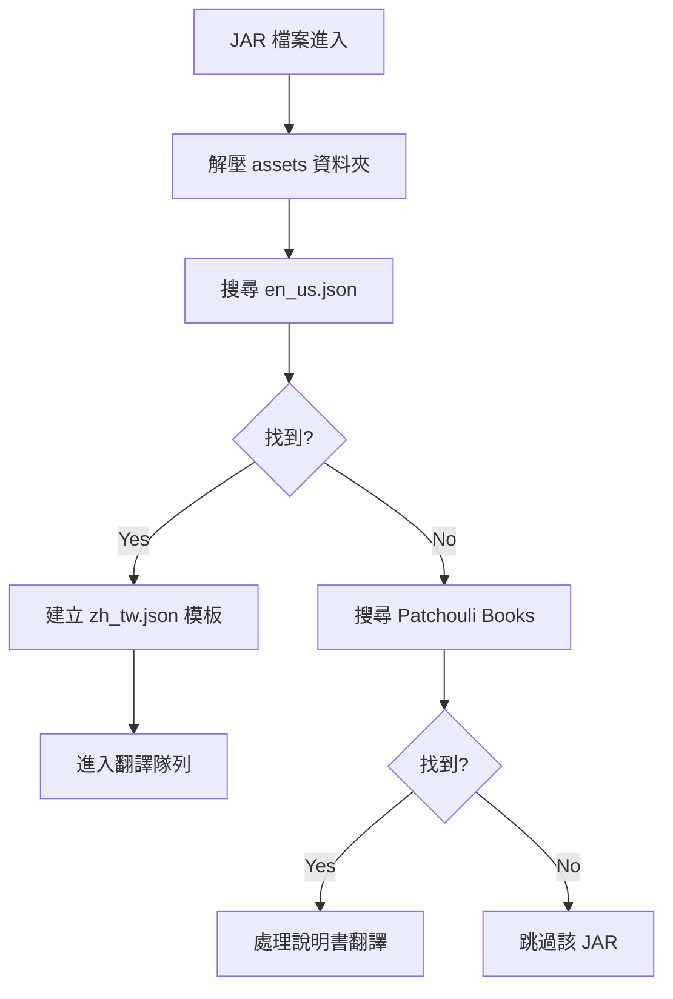

# 檔案處理流水線 (File Pipeline)

## 1. 檔案掃描與處理流程

本模組負責專案中所有檔案的識別、解壓與寫入。

### 掃描階段 (Scanning)
- **並行掃描**: 使用 `tokio::task::JoinSet` 同時掃描多個目錄或 JAR 檔案。
- **路徑規範化**：引入 `canonicalize()` 處理，確保 Windows 平台下 `rel_path` 生成的穩定性。
- **預過濾**: 根據檔案副檔名 (`.jar`, `.json`, `.js`) 分流至對應的處理器。

## 2. JAR 處理流程圖

## 3. 資源包封裝 (Packaging)
- **Temp Partitioning**: 翻譯結果暫存於系統臨時目錄。
- **路徑安全檢查**：寫入前強制執行相對路徑驗證，防止「路徑溢出」安全風險。
- **匯出 ZIP**: 將所有譯後檔案重新封裝為符合 Minecraft 規格的 `LLMTranslator.zip` 資源包。
