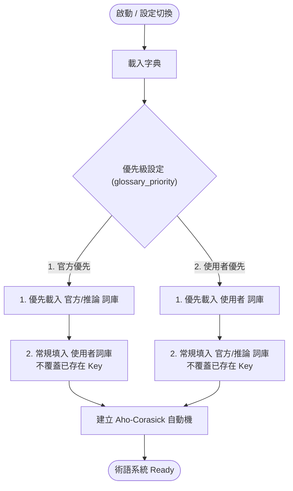
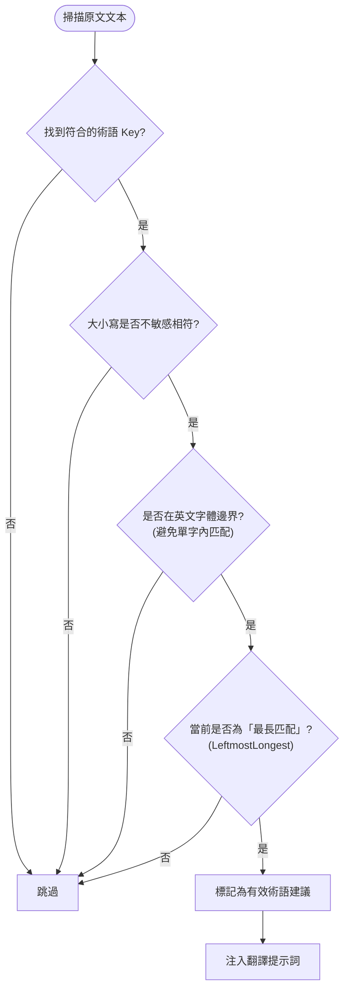

# 術語系統

## 資料來源

- 官方詞庫：由 Minecraft 官方語言檔（從 GitHub 動態下載，取消靜態固定）對照產生。
  - **條件式對照載入**：推論詞庫常規不會產出，**僅在 `source_lang == "en_us"` 且 `target_lang == "zh_tw"` 時**，才會進行 `exact` 對照和生成。
- 推論詞庫：由 `analyze_dictionary` 從官方詞庫推導並存到 `dicts/official/{ui_lang}.json`
- 使用者詞庫：`dicts/user/{ui_lang}.json`

## 優先級

- `glossary_priority` 決定同 key 的覆蓋順序
- `official` 優先時：官方詞庫先載入，再載入使用者詞庫
- `user` 優先時：使用者詞庫先載入，再載入官方詞庫

## Aho-Corasick 自動機

- 以 `LeftmostLongest` 匹配策略
- 大小寫不敏感
- 僅在英文字邊界符合時視為有效術語

## UI 行為摘要

- 官方分頁的編輯內容會轉存到使用者詞庫
- 字典管理器支援匯入、匯出、搜尋、批次取代

## 載入與刷新

- 於啟動或設定切換時，一次性讀取與推論公式併入快取，不再使用背景目錄監控以減少 IO 防護鎖互斥。
- 推論結果依然會快取覆寫至 `dicts/official/{ui_lang}.json`。

## 術語載入與優先級覆蓋權

以下說明「官方」與「使用者」詞庫在不同優先級設定下，如何透過 **「先載入者優先 (不覆蓋已存在的 Key)」** 的邏輯進行整合。

## 術語 Aho-Corasick 匹配決策樹

說明 Aho-Corasick 自動機在掃描原文時的過濾與校驗規則。

