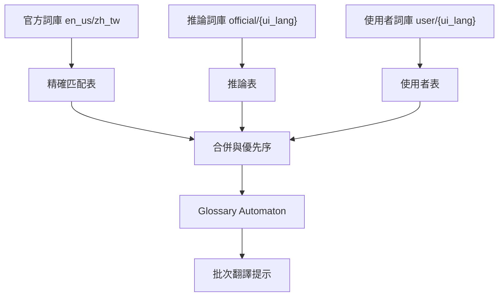

# 術語系統

本系統用於提供翻譯提示，不直接替換原文。

## 資料來源

- 官方詞庫: `dicts/en_us.json` + `dicts/zh_tw.json`
- 推論詞庫: 由官方詞庫推論後寫入 `dicts/official/{target_lang}.json`
- 使用者詞庫: `dicts/user/{target_lang}.json`

## 流程圖

## 推論規則

- 基於目標語言 (`target_lang`) 啟用，不限於特定語言組合
- 以詞頻與 CJK 字元比例推論常見中文片語
- 黑名單詞彙會被剔除

## 優先序

- `glossary_priority = official`: 官方優先
- `glossary_priority = user`: 使用者優先

## 匹配行為

- 使用 Aho-Corasick 進行多模式匹配
- 僅在字詞邊界匹配成功時生效
- 每批次最多使用 30 筆術語提示

## 快速簡繁轉換模式 (Fast Chinese Conversion)

當啟用快速簡繁轉換時：

- **優先級提升**：術語表不再僅作為「提示」，而是作為「強制替換規則」。
- **邏輯分流**：先以 `Glossary Automaton` 進行術語優先替換，其餘內容才執行字元級轉換 (`hanconv`)。
- **支援對象**：目前專為 `zh_cn` (簡體) 與 `zh_tw` (繁體) 之間的互轉設計。

## 相關檔案

- [src/translation/glossary/mc_lang.rs](/src/translation/glossary/mc_lang.rs)
- [src/translation/glossary/analyzer.rs](/src/translation/glossary/analyzer.rs)
- [src/translation/glossary/automaton.rs](/src/translation/glossary/automaton.rs)
- [src/config/dictionary.rs](/src/config/dictionary.rs)

## 相關連結

- [翻譯核心](translation_core.md)
- [翻譯記憶體](translation_memory.md)
- [UI 交互](../ui/interactions.md)
