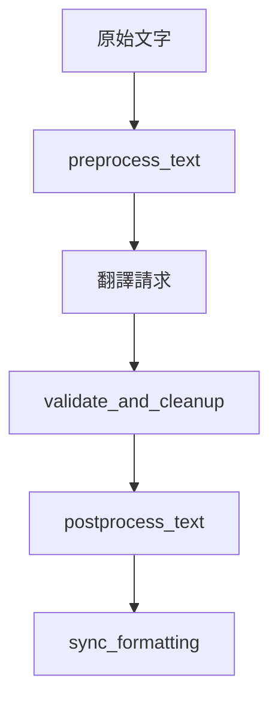

# 工具模組 (utils)

本文件說明專案中與翻譯流程密切相關的工具函式。

## 跳過規則

- 位置: [src/utils/skip_rules.rs](/src/utils/skip_rules.rs)
- 功能: 判斷 key 或 value 是否需要翻譯
- 例外: 純空白字串不會被跳過

## 文本處理

- 位置: [src/utils/text_processing.rs](/src/utils/text_processing.rs)
- 功能: 格式標記保護、翻譯結果清理、JSON 內容同步

## 日誌與顯示

- 位置: [src/utils/helpers.rs](/src/utils/helpers.rs)
- `add_log_event` 會在啟用時寫入 `logs/debug.log`
- `extract_display_path` 會優先顯示 `assets/` 或 `data/` 的 modid

## 流程圖

## 相關檔案

- [src/utils/skip_rules.rs](/src/utils/skip_rules.rs)
- [src/utils/text_processing.rs](/src/utils/text_processing.rs)
- [src/utils/helpers.rs](/src/utils/helpers.rs)
