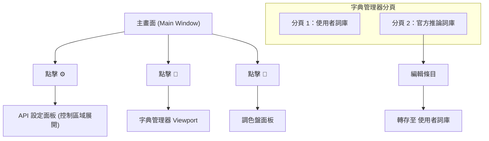

# UI 交互與觸發

## 主流程

1. 選擇檔案或資料夾
2. 設定服務商與模型
3. 點擊開始翻譯
4. 翻譯中可暫停、繼續或停止

## 主要按鈕行為

- `⚙`：切換 API 設定面板
- `📖`：切換字典管理器 Viewport
- `🎨`：切換調色盤面板
- `🌓`：切換主題
- `🔧`：切換開發者模式

## 字典管理器

- 兩個分頁：使用者詞庫、官方推論詞庫
- 支援搜尋、分頁、匯入、匯出
- 官方分頁的編輯會轉存到使用者詞庫

## UI 面板導航與狀態切換

以下示意主畫面「面板展開點擊」與字典管理器視窗內部的分頁架構。

