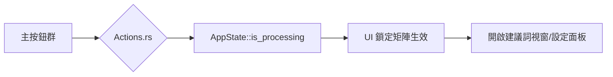

# UI 交互與觸發地圖 (Interactions Map)

## 1. 交互邏輯圖

## 2. 視窗穩態行為
- **Viewport 固定延遲**: 為了解決 `egui` 子視窗啟動閃爍，系統在視窗開啟首幀限制渲染，直到座標與主題繼承完成。
- **拖曳與快捷鍵**:
    - `Enter`: 在彈出對話框中快速提交。
    - `ESC`: 關閉子視窗。
    - 滑鼠滾輪: 支援所有 `DragValue` 的數值快速微調。

## 3. 邏輯觸發清單
- **整理辭典**: 觸發磁碟同步與詞條去重。
- **切換主題**: 即時更新全域變數並通知所有 Viewport 重繪。
- **點擊日誌**: 雙擊日誌行可快速定位或複製路徑。
