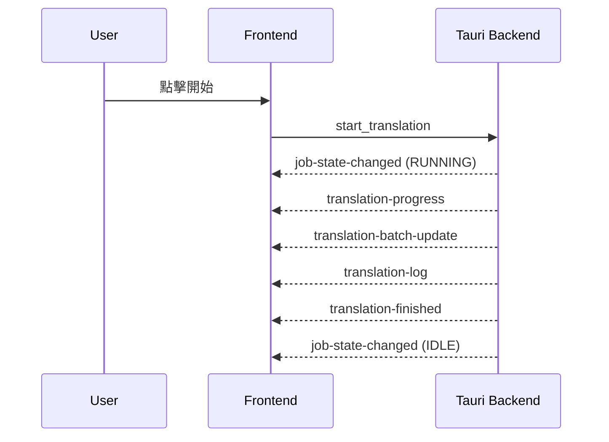

<!-- 最後更新: 2026-04-06 | 對應版本: v1.0.0 -->

# UI 交互行為

## 啟動與載入

- 啟動時載入 config、i18n、style、字典
- Tauri ready 後顯示主視窗
- 主題切換會立即套用並儲存 style.cfg

## 翻譯流程

1. 使用者選擇輸入路徑與輸出路徑
2. 按下開始後，UI 進入 Running 狀態
3. 狀態列顯示進度與批次進度
4. 完成後恢復為 Idle 並顯示結果

## 暫停與繼續

- 暫停後允許修改設定
- 繼續時會先更新後端設定快照，再恢復翻譯

## 停止

- 停止會要求使用者確認
- 停止後狀態回到 Idle

## 設定重置

- API 區塊提供「恢復預設」按鈕，只重置 API 與翻譯參數，不會重置 `excluded_paths` 與 `system_prompt`
- 開發者區塊提供「恢復預設」按鈕，重置跳過規則、日誌開關、`system_prompt` 與 `excluded_paths`
- 調色盤區塊提供「恢復預設」按鈕，回到 StyleConfig 預設值

## 調色盤覆寫

- 全域模式: 直接覆寫 `dark_*` / `light_*` 欄位並立刻存檔
- 特定元件模式: 寫入 `instance_overrides`，依當前主題寫入 `dark_*` 或 `light_*`
- 特定元件可用「清除覆寫」按鈕移除單一元件覆寫

## 狀態與元件行為對照表

| 元件/行為 | 待機 (Idle) | 進行中 (Running) | 暫停 (Paused) |
| --- | --- | --- | --- |
| 輸入路徑 | 可編輯 | 鎖定 | 可編輯 |
| 輸出路徑 | 可編輯 | 鎖定 | 可編輯 |
| API 設定區 | 可編輯 | 鎖定 | 可編輯 |
| 翻譯參數區 | 可編輯 | 鎖定 | 可編輯 |
| 開發者設定 | 可編輯 | 鎖定 | 可編輯 |
| User/System Prompt | 可編輯 | 鎖定 | 可編輯 |
| 開始按鈕 | 顯示 | 隱藏 | 隱藏 |
| 暫停按鈕 | 隱藏 | 顯示 | 隱藏 |
| 繼續按鈕 | 隱藏 | 隱藏 | 顯示 |
| 停止按鈕 | 隱藏 | 隱藏 | 顯示 |
| 暫停提示 | 隱藏 | 隱藏 | 顯示 |

## 事件與狀態同步

- `job-state-changed`: 切換 Idle/Running/Paused
- `translation-progress`: 更新進度條與狀態文字
- `translation-batch-update`: 更新批次進度
- `translation-log`: 日誌輸出
- `translation-finished`: 顯示完成或失敗

## UI 事件流 (總覽)

## 建議詞管理器

- 開啟後為獨立視窗
- 修改字典會廣播 `dictionary-changed` 事件

## 輸出資料夾開啟

- 使用者可透過 UI 直接開啟輸出資料夾
- 若未設定輸出路徑則使用 `LLMTranslator/`
