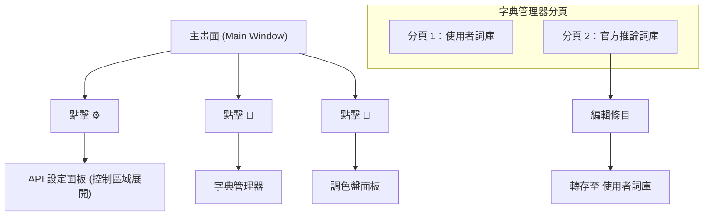

# UI 交互與觸發 (Tauri 原生)

## 核心流程

1. 選擇檔案或資料夾
2. 設定服務商與模型
3. 點擊開始翻譯
4. 翻譯中可暫停、繼續或停止

## 主要按鈕行為

- `⚙`：切換 API 設定面板架構。
- `📖`：開啟建議詞管理器 (獨立視窗 `WebviewWindow`)。
- `🎨`：切換調色盤與樣式同步面板。
- `🌓`：切換深色/淺色主題。
- `🔧`：切換開發者模式。

## 字典管理器

- **兩個分頁**：使用者詞庫、官方推論詞庫。
- 支援搜尋、分頁、匯入、匯出。
- **官方轉存**：官方分頁的編輯會轉存到使用者詞庫保存。

## UI 面板導航與狀態切換

## 狀態鎖定規則

- 翻譯中且未暫停時，設定面板多數欄位會鎖定。
- 暫停時會解除鎖定，可修改設定繼續使用。
- 主題、調色盤、字典管理器不受處理狀態影響。
