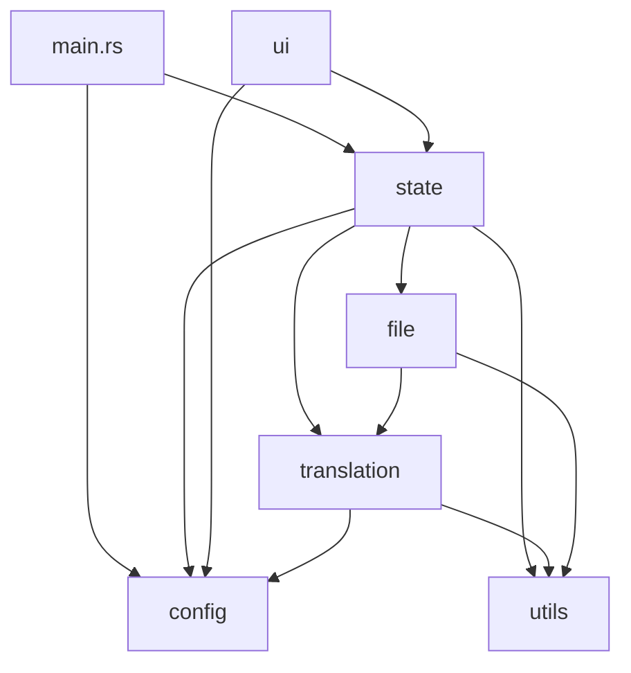

# 模組重構實施計畫（補強版）

基於 [submod_analysis.md](file:///C:/Users/mn12345678910/.gemini/antigravity/brain/db78e511-c224-4602-81bb-b5ede8fd6bd0/submod_analysis.md) 的可行性分析，提出補強後的完整重構方案。

---

## 補強後的最終目錄結構

```
src/
├── lib.rs                        # 函式庫入口，統一匯出與向後相容
├── main.rs                       # 應用程式入口
│
├── config/                       ← 配置模組
│   ├── mod.rs                    # pub use 重新匯出
│   ├── settings.rs               # AppConfig, DEFAULT_PROMPT, 常數
│   ├── dictionary.rs             # load_dict, save_dict, ensure_dicts_dir, 辭典常數
│   └── encryption.rs             # DPAPI encrypt/decrypt
│
├── state/                        ← 全域狀態模組 [新增]
│   ├── mod.rs
│   ├── app_state.rs              # AppState 結構體 + new() + 基礎方法
│   ├── viewer_state.rs           # ViewerSharedState, ViewerUpdate 列舉
│   └── actions.rs                # start_translation, resume, pause, stop, refresh_*, save_config
│
├── translation/                  ← 翻譯核心模組
│   ├── mod.rs
│   ├── job.rs                    # JobConfig, JobSharedState (原 translation_job.rs，不動)
│   ├── context.rs                # TranslationContext, ContextOptions [新增]
│   ├── engine.rs                 # translate_json_recursive, collect_translatable_strings, count_strings
│   ├── batching.rs               # translate_global_batches, run_translation_batch, create_adaptive_batches
│   ├── api/
│   │   ├── mod.rs
│   │   ├── client.rs             # translate_one, translate_batch, translate_with_*
│   │   └── models.rs             # fetch_dynamic_models, fetch_*_models, fetch_mc_versions
│   └── glossary/                 (原 dictionary/ → 更名為 glossary/ 避免與 config/dictionary 混淆)
│       ├── mod.rs
│       ├── automaton.rs          # GlossaryAutomaton, GlossaryEntry, TermType
│       ├── analyzer.rs           # analyze_dictionary, find_common_hanzi, clean_inferred_zh
│       └── mc_lang.rs            # McLangFiles, load_mc_dicts
│
├── file/                         ← 檔案處理模組
│   ├── mod.rs
│   ├── scanner.rs                # scan_files_recursive, check_*_has_target [從 ui.rs + file_handler.rs 提取]
│   ├── jar_handler.rs            # collect_jar_tasks, repack_jar
│   ├── json_handler.rs           # collect_json_task, apply_json_task [新增：從 file_handler.rs 提取]
│   ├── js_handler.rs             # collect_js_task, apply_js_task, JS_REGEX_LIST [新增]
│   ├── pipeline.rs               # process_all_files, apply_global_results (原 file_handler.rs 核心流程)
│   └── pack_gen.rs               # output_resource_pack, write_to_temp_or_output
│
├── ui/                           ← UI 模組
│   ├── mod.rs
│   ├── app.rs                    # eframe::App impl (update 主迴圈)
│   ├── theme.rs                  # render_theme_application
│   ├── constants.rs              # LABEL_COLOR_LIGHT, LABEL_COLOR_DARK [新增]
│   ├── components/
│   │   ├── mod.rs
│   │   ├── header.rs             # render_header_controls, render_status_navigation
│   │   ├── settings.rs           # render_settings_panel
│   │   ├── developer.rs          # render_developer_mode_panel
│   │   ├── progress.rs           # render_progress_section
│   │   ├── actions.rs            # render_action_buttons
│   │   └── log.rs                # render_log_area
│   ├── viewport/
│   │   ├── mod.rs
│   │   ├── manager.rs            # show_viewport_if_needed, create_viewport_deferred
│   │   ├── viewer_content.rs     # render_memory_viewer_content (主表格渲染)
│   │   └── dialogs.rs            # 新增/取代/清除 對話框邏輯
│   └── widgets/
│       ├── mod.rs
│       └── toggle.rs             # 自訂 Widget
│
└── utils/                        ← 工具模組
    ├── mod.rs
    ├── helpers.rs                # add_log, format_log_message, extract_display_path, hashmap_to_entries
    ├── text_processing.rs        # preprocess_text, validate_and_cleanup, detect_loop, etc. [已新增]
    └── skip_rules.rs             # should_skip_key, should_skip_value, SKIP_KEYS [新增]
```

---

## 跨模組依賴關係圖



> [!IMPORTANT]
> 依賴方向為**單向**：`ui → state → {config, translation, file, utils}`。
> 重構時必須**從底層開始**（`utils` → `config` → `translation` → `file` → `state` → `ui`）。

---

## 各 Phase 詳細規劃

### Phase 0：準備工作
- 確認 `cargo check` 通過
- 備份現有程式碼（已有 Git 分支 `refactor/module-restructure`）

---

### Phase 1：`utils/` 模組（最底層，無外部依賴）

#### [MODIFY] [utils.rs](file:///x:/D/MCTEST/mc_translator_rs/src/utils.rs) → 拆分為 3 個檔案

| 新檔案 | 來源行號 | 內容 |
|---|---|---|
| `utils/helpers.rs` | L457-497 | `add_log`, `format_log_message`, `extract_display_path`, `hashmap_to_entries` |
| `utils/skip_rules.rs` | 從 `data_processing.rs` L10-35, L472-542 | `SKIP_KEYS`, `should_skip_key`, `should_skip_value` |
| `utils/mod.rs` | — | `pub use` 重新匯出所有公開 API |

> [!NOTE]
> `GlossaryAutomaton` 相關 (L120-277)、`McLangFiles` + `load_mc_dicts` (L12-118)、`analyze_dictionary` (L321-437) 將在 Phase 3 移至 `translation/glossary/`。Phase 1 暫時保留在 `utils.rs` 並以 `pub use` 轉發。

#### 遷移步驟
1. 建立 `src/utils/` 目錄與 `mod.rs`
2. 將工具函式移至 `helpers.rs`
3. 將 `should_skip_key/value` 從 `data_processing.rs` 提取至 `skip_rules.rs`
4. 在 `utils/mod.rs` 中 `pub use` 所有公開名稱
5. 原 `utils.rs` 改為轉發模組：`pub mod utils;` → 指向目錄
6. 執行 `cargo check`
7. Git 提交

---

### Phase 2：`config/` 模組

#### [MODIFY] [config.rs](file:///x:/D/MCTEST/mc_translator_rs/src/config.rs) → 拆分為 3 個檔案

| 新檔案 | 來源行號 | 內容 |
|---|---|---|
| `config/settings.rs` | L1-158 | `AppConfig`, `DEFAULT_PROMPT`, `load()`, `save()` |
| `config/dictionary.rs` | L160-197 | `DICT_DIR`, `USER_DICT`, `OFFICIAL_DICT`, `ensure_dicts_dir`, `load_dict`, `save_dict`, `load_translation_memory`, `save_translation_memory` |
| `config/encryption.rs` | L199-298 | `encrypt_string`, `decrypt_string` (含 Windows/非 Windows 條件編譯) |

#### 遷移步驟
1. 建立 `src/config/` 目錄與 `mod.rs`
2. 分別建立三個子檔案
3. `config/mod.rs` 中 `pub use` 所有公開名稱
4. `cargo check` → Git 提交

---

### Phase 3：`translation/` 模組（核心翻譯邏輯）

最複雜的一步，涉及 4 個原始檔案的拆分與重組。

#### 3a. `translation/job.rs` — 直接搬移

[MODIFY] [translation_job.rs](file:///x:/D/MCTEST/mc_translator_rs/src/translation_job.rs)：整檔搬移至 `translation/job.rs`，在原位留 `pub use` 轉發。

#### 3b. `translation/glossary/` — 從 `utils.rs` 提取

| 新檔案 | 來源 | 內容 |
|---|---|---|
| `glossary/automaton.rs` | `utils.rs` L120-277 | `GlossaryAutomaton`, `GlossaryEntry`, `TermType` |
| `glossary/analyzer.rs` | `utils.rs` L293-437 | `analyze_dictionary`, `find_common_hanzi`, `is_cjk`, `clean_inferred_zh`, `INFERENCE_BLACKLIST` |
| `glossary/mc_lang.rs` | `utils.rs` L12-118 | `McLangFiles`, `load_mc_dicts` |

#### 3c. `translation/api/` — 從 `translation_service.rs` 提取

| 新檔案 | 來源行號 | 內容 |
|---|---|---|
| `api/client.rs` | L10-463 | `CLIENT`, `build_system_prompt`, `translate_one`, `translate_batch`, `translate_with_*`, `call_ollama_raw`, 正則常量, `log_llm_communication` |
| `api/models.rs` | L547-678 | `fetch_dynamic_models`, `fetch_*_models`, `fetch_mc_versions`, `version_to_pack_format`, `get_static_mc_versions` |

#### 3d. `translation/` 核心 — 從 `data_processing.rs` 提取

| 新檔案 | 來源行號 | 內容 |
|---|---|---|
| `context.rs` | L38-95 | `TranslationContext`, `ContextOptions` |
| `engine.rs` | L545-800, L802-889, L1170-1221 | `translate_json_recursive`, `collect_translatable_strings`, `count_strings` |
| `batching.rs` | L97-470 | `GlobalBatchItem`, `translate_global_batches`, `run_translation_batch`, `create_adaptive_batches`, `BatchContext`, `RunBatchContext` |

> [!NOTE]
> `text_processing` 相關函式 (validate_and_cleanup, detect_loop, preprocess_text, postprocess_text, sync_formatting, PLACEHOLDER_RE) 已在前置作業中提取至 `utils/text_processing.rs` 以解除循環依賴，因此 Phase 3 不需再搬移這部分。

#### 遷移步驟
1. 建立 `src/translation/` 目錄結構
2. 按 3a → 3b → 3c → 3d 順序搬移，每步 `cargo check`
3. 更新所有 `crate::` 路徑引用
4. 在 `translation/mod.rs` 設定 `pub use` 轉發
5. Git 提交

---

### Phase 4：`file/` 模組

#### [MODIFY] [file_handler.rs](file:///x:/D/MCTEST/mc_translator_rs/src/file_handler.rs) → 拆分為 6 個檔案

| 新檔案 | 來源行號 | 內容 |
|---|---|---|
| `file/scanner.rs` | L334-451 + 從 `ui.rs` 提取 `scan_files_recursive` | `check_jar_has_target`, `check_js_has_target`, `check_json_has_target`, `scan_files_recursive` |
| `file/jar_handler.rs` | L611-723, L797-858 | `collect_jar_tasks`, `repack_jar` |
| `file/json_handler.rs` | L75-193 | `collect_json_task`, `apply_json_task` |
| `file/js_handler.rs` | L195-332, L1012-1034 | `collect_js_task`, `apply_js_task`, `JS_REGEX_LIST`, `JS_INNER_*_RE` |
| `file/pipeline.rs` | L453-609, L725-794 | `process_all_files`, `apply_global_results`, `FileTask`, `FileStatus` |
| `file/pack_gen.rs` | L860-1010 | `write_to_temp_or_output`, `output_resource_pack` |

#### 遷移步驟
1. 建立 `src/file/` 目錄結構
2. 逐一搬移檔案，更新 `crate::` 路徑
3. `cargo check` → Git 提交

---

### Phase 5：`state/` 模組 [新增]

#### [MODIFY] [state_and_log.rs](file:///x:/D/MCTEST/mc_translator_rs/src/state_and_log.rs) → 拆分為 3 個檔案

| 新檔案 | 來源行號 | 內容 |
|---|---|---|
| `state/viewer_state.rs` | L16-34 | `ViewerUpdate`, `ViewerSharedState` |
| `state/app_state.rs` | L37-155, L244-307 | `AppState` 結構體定義、`new()`、`add_log`、`is_processing_active` |
| `state/actions.rs` | L245-510 | `refresh_all_dictionaries`, `refresh_dictionaries_core`, `refresh_models`, `refresh_mc_versions`, `save_config`, `start_translation`, `resume_translation`, `stop_translation`, `pause_translation` |

#### 遷移步驟
1. 建立 `src/state/` 目錄結構
2. 搬移結構體與方法（注意 `impl AppState` 的方法分散在 `state/actions.rs` 與 `ui/` 中）
3. 更新 `main.rs` 的 `use` 路徑
4. `cargo check` → Git 提交

---

### Phase 6：`ui/` 模組（最上層）

#### [MODIFY] [ui.rs](file:///x:/D/MCTEST/mc_translator_rs/src/ui.rs) → 拆分為 12+ 個檔案

| 新檔案 | 估計來源行號 | 內容 |
|---|---|---|
| `ui/constants.rs` | L5-7 | `LABEL_COLOR_LIGHT`, `LABEL_COLOR_DARK` |
| `ui/app.rs` | L9-146 | `eframe::App` impl |
| `ui/theme.rs` | L329-421 | `render_theme_application` |
| `ui/components/header.rs` | L423-568 | `render_header_controls`, `render_status_navigation` |
| `ui/components/settings.rs` | L570-890 | `render_settings_panel` |
| `ui/components/developer.rs` | ~L891-980 | `render_developer_mode_panel` |
| `ui/components/progress.rs` | ~L980-1060 | `render_progress_section` |
| `ui/components/actions.rs` | ~L1060-1140 | `render_action_buttons` |
| `ui/components/log.rs` | ~L1140-1200 | `render_log_area` |
| `ui/viewport/manager.rs` | L148-327 | `show_viewport_if_needed`, `create_viewport_deferred` |
| `ui/viewport/viewer_content.rs` | ~L1200-1600 | `render_memory_viewer_content` |
| `ui/viewport/dialogs.rs` | ~L1600-1856 | 新增/取代/清除對話框 |

#### 遷移步驟
1. 建立 `src/ui/` 完整目錄結構
2. 先抽出 `constants.rs`、`theme.rs`（零依賴）
3. 逐一搬移各 `render_*` 方法
4. Viewport 閉包函式較複雜，需額外注意 Arc 變數的捕獲
5. `cargo check` → Git 提交

---

### Phase 7：`lib.rs` 向後相容與清理

```rust
// lib.rs — 統一匯出
pub mod config;
pub mod state;
pub mod translation;
pub mod file;
pub mod ui;
pub mod utils;

// 向後相容：保留舊路徑可用
pub use config::settings::AppConfig;
pub use config::dictionary::{load_dict, save_dict, DICT_DIR, USER_DICT, OFFICIAL_DICT};
pub use config::encryption::{encrypt_string, decrypt_string};
pub use state::app_state::AppState;
pub use state::viewer_state::{ViewerSharedState, ViewerUpdate};
pub use translation::job::{JobConfig, JobSharedState};
pub use translation::glossary::automaton::{GlossaryAutomaton, GlossaryEntry, TermType};
pub use utils::helpers::{add_log, format_log_message};
```

#### 步驟
1. 更新 `lib.rs` 匯出
2. 更新 `main.rs` 的 `use` 路徑
3. 移除所有舊的頂層 `.rs` 檔案（已被模組目錄取代）
4. 最終 `cargo check` + `cargo build --release`
5. Git 提交

---

## 驗證方案

### 自動化驗證

每個 Phase 完成後執行以下指令：

```powershell
# 1. 編譯檢查（最快速驗證）
cargo check 2>&1

# 2. 完整編譯（確認無 dead_code 或未使用 import 警告）
cargo build 2>&1

# 3. 最終 Phase 完成後：Release 建置
cargo build --release 2>&1
```

> [!NOTE]
> 根據 `docs/testing.md`，目前專案的內置測試已全面移除（生產環境說明 2026-03-07），因此無法使用 `cargo test`。驗證以 `cargo check` 和 `cargo build --release` 為主。

### 手動驗證

重構全部完成後，請使用者執行以下步驟：

1. **啟動應用程式**：雙擊或執行 `cargo run`，確認主視窗正常顯示
2. **切換主題**：點擊 🌓 按鈕，確認深色/淺色主題正確切換
3. **開啟建議詞管理器**：點擊 📖 按鈕，確認 Viewport 無閃爍正常開啟
4. **API 設定面板**：點擊 ⚙ 按鈕，確認所有欄位可正常操作
5. **選擇檔案**：點擊「📁 選擇檔案」，確認檔案對話框可正常開啟

---

## 預估工作量

| Phase | 檔案數 | 預估難度 | 備註 |
|---|---|---|---|
| Phase 1: `utils/` | 3 | 🟢 簡單 | 純函式搬移 |
| Phase 2: `config/` | 3 | 🟢 簡單 | 已有清晰分界 |
| Phase 3: `translation/` | 10 | 🟡 中等 | 涉及 4 個原始檔案拆分 |
| Phase 4: `file/` | 6 | 🟡 中等 | 1034 行拆分 |
| Phase 5: `state/` | 3 | 🟡 中等 | 耦合度最高 |
| Phase 6: `ui/` | 12 | 🔴 困難 | 1856 行 + Viewport 閉包 |
| Phase 7: 清理 | 2 | 🟢 簡單 | 機械性工作 |
| **合計** | **~39 個新檔案** | | |
