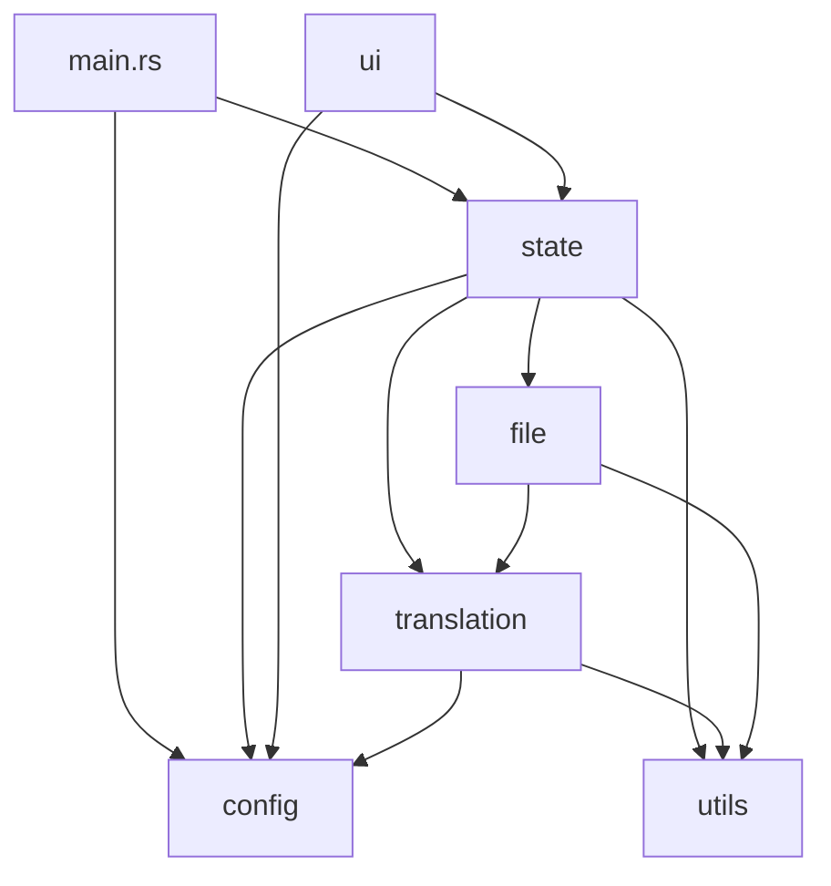

# 模組重構實施計畫 - Phase 5 到 Phase 7

基於之前的重構進度，以下是尚未完成的 Phase 5 至 Phase 7 實施計畫。

---

## 最終完整目錄結構 (含 Phase 1-7)

```
src/
├── lib.rs                        # 函式庫入口，統一匯出與向後相容
├── main.rs                       # 應用程式入口
│
├── config/                       ← 配置模組 [Phase 2]
│   ├── mod.rs                    # pub use 重新匯出
│   ├── settings.rs               # AppConfig, DEFAULT_PROMPT, 常數
│   ├── dictionary.rs             # load_dict, save_dict, ensure_dicts_dir, 辭典常數
│   └── encryption.rs             # DPAPI encrypt/decrypt
│
├── state/                        ← 全域狀態模組 [Phase 5]
│   ├── mod.rs
│   ├── app_state.rs              # AppState 結構體 + new() + 基礎方法
│   ├── viewer_state.rs           # ViewerSharedState, ViewerUpdate 列舉
│   └── actions.rs                # start_translation, resume, pause, stop, refresh_*, save_config
│
├── translation/                  ← 翻譯核心模組 [Phase 3]
│   ├── mod.rs
│   ├── job.rs                    # JobConfig, JobSharedState
│   ├── context.rs                # TranslationContext, ContextOptions
│   ├── engine.rs                 # translate_json_recursive, collect_translatable_strings, count_strings
│   ├── batching.rs               # translate_global_batches, run_translation_batch
│   ├── api/
│   │   ├── mod.rs
│   │   ├── client.rs             # translate_one, translate_batch, translate_with_*
│   │   └── models.rs             # fetch_dynamic_models, fetch_*_models, fetch_mc_versions
│   └── glossary/
│       ├── mod.rs
│       ├── automaton.rs          # GlossaryAutomaton, GlossaryEntry, TermType
│       ├── analyzer.rs           # analyze_dictionary, find_common_hanzi, clean_inferred_zh
│       └── mc_lang.rs            # McLangFiles, load_mc_dicts
│
├── file/                         ← 檔案處理模組 [Phase 4]
│   ├── mod.rs
│   ├── scanner.rs                # scan_files_recursive, check_*_has_target
│   ├── jar_handler.rs            # collect_jar_tasks, repack_jar
│   ├── json_handler.rs           # collect_json_task, apply_json_task
│   ├── js_handler.rs             # collect_js_task, apply_js_task, JS_REGEX_LIST
│   ├── pipeline.rs               # process_all_files, apply_global_results
│   └── pack_gen.rs               # output_resource_pack, write_to_temp_or_output
│
├── ui/                           ← UI 模組 [Phase 6]
│   ├── mod.rs
│   ├── app.rs                    # eframe::App impl (update 主迴圈)
│   ├── theme.rs                  # render_theme_application
│   ├── constants.rs              # LABEL_COLOR_LIGHT, LABEL_COLOR_DARK
│   ├── components/
│   │   ├── mod.rs
│   │   ├── header.rs             # render_header_controls, render_status_navigation
│   │   ├── settings.rs           # render_settings_panel
│   │   ├── developer.rs          # render_developer_mode_panel
│   │   ├── progress.rs           # render_progress_section
│   │   ├── actions.rs            # render_action_buttons
│   │   └── log.rs                # render_log_area
│   ├── viewport/
│   │   ├── mod.rs
│   │   ├── manager.rs            # show_viewport_if_needed, create_viewport_deferred
│   │   ├── viewer_content.rs     # render_memory_viewer_content (主表格渲染)
│   │   └── dialogs.rs            # 新增/取代/清除 對話框邏輯
│   └── widgets/
│       ├── mod.rs
│       └── toggle.rs             # 自訂 Widget
│
└── utils/                        ← 工具模組 [Phase 1]
    ├── mod.rs
    ├── helpers.rs                # add_log, format_log_message, extract_display_path, hashmap_to_entries
    ├── text_processing.rs        # preprocess_text, validate_and_cleanup, detect_loop, etc.
    └── skip_rules.rs             # should_skip_key, should_skip_value, SKIP_KEYS
```

---

## 跨模組依賴關係圖



> [!IMPORTANT]
> 依賴方向為**單向**：`ui → state → {config, translation, file, utils}`。
> 重構時必須**從底層開始**（已完成 `utils` → `config` → `translation` → `file`，接下來是 `state` → `ui`）。

---

### Phase 5：`state/` 模組 [新增]

#### [MODIFY] [state_and_log.rs](file:///x:/D/MCTEST/mc_translator_rs/src/state_and_log.rs) → 拆分為 3 個檔案

| 新檔案 | 來源行號 | 內容 |
|---|---|---|
| `state/viewer_state.rs` | L16-34 | `ViewerUpdate`, `ViewerSharedState` |
| `state/app_state.rs` | L37-155, L244-307 | `AppState` 結構體定義、`new()`、`add_log`、`is_processing_active` |
| `state/actions.rs` | L245-510 | `refresh_all_dictionaries`, `refresh_dictionaries_core`, `refresh_models`, `refresh_mc_versions`, `save_config`, `start_translation`, `resume_translation`, `stop_translation`, `pause_translation` |

#### 遷移步驟
1. 建立 `src/state/` 目錄結構
2. 搬移結構體與方法（注意 `impl AppState` 的方法分散在 `state/actions.rs` 與 `ui/` 中）
3. 更新 `main.rs` 的 `use` 路徑
4. `cargo check` → Git 提交

---

### Phase 6：`ui/` 模組（最上層）

#### [MODIFY] [ui.rs](file:///x:/D/MCTEST/mc_translator_rs/src/ui.rs) → 拆分為 12+ 個檔案

| 新檔案 | 估計來源行號 | 內容 |
|---|---|---|
| `ui/constants.rs` | L5-7 | `LABEL_COLOR_LIGHT`, `LABEL_COLOR_DARK` |
| `ui/app.rs` | L9-146 | `eframe::App` impl |
| `ui/theme.rs` | L329-421 | `render_theme_application` |
| `ui/components/header.rs` | L423-568 | `render_header_controls`, `render_status_navigation` |
| `ui/components/settings.rs` | L570-890 | `render_settings_panel` |
| `ui/components/developer.rs` | ~L891-980 | `render_developer_mode_panel` |
| `ui/components/progress.rs` | ~L980-1060 | `render_progress_section` |
| `ui/components/actions.rs` | ~L1060-1140 | `render_action_buttons` |
| `ui/components/log.rs` | ~L1140-1200 | `render_log_area` |
| `ui/viewport/manager.rs` | L148-327 | `show_viewport_if_needed`, `create_viewport_deferred` |
| `ui/viewport/viewer_content.rs` | ~L1200-1600 | `render_memory_viewer_content` |
| `ui/viewport/dialogs.rs` | ~L1600-1856 | 新增/取代/清除對話框 |

#### 遷移步驟
1. 建立 `src/ui/` 完整目錄結構
2. 先抽出 `constants.rs`、`theme.rs`（零依賴）
3. 逐一搬移各 `render_*` 方法
4. Viewport 閉包函式較複雜，需額外注意 Arc 變數的捕獲
5. `cargo check` → Git 提交

---

### Phase 7：`lib.rs` 向後相容與清理

```rust
// lib.rs — 統一匯出
pub mod config;
pub mod state;
pub mod translation;
pub mod file;
pub mod ui;
pub mod utils;

// 向後相容：保留舊路徑可用
pub use config::settings::AppConfig;
pub use config::dictionary::{load_dict, save_dict, DICT_DIR, USER_DICT, OFFICIAL_DICT};
pub use config::encryption::{encrypt_string, decrypt_string};
pub use state::app_state::AppState;
pub use state::viewer_state::{ViewerSharedState, ViewerUpdate};
pub use translation::job::{JobConfig, JobSharedState};
pub use translation::glossary::automaton::{GlossaryAutomaton, GlossaryEntry, TermType};
pub use utils::helpers::{add_log, format_log_message};
```

#### 步驟
1. 更新 `lib.rs` 匯出
2. 更新 `main.rs` 的 `use` 路徑
3. 移除所有舊的頂層 `.rs` 檔案（已被模組目錄取代）
4. 最終 `cargo check` + `cargo build --release`
5. Git 提交

---

## 驗證方案

### 自動化驗證

每個 Phase 完成後執行以下指令：

```powershell
# 1. 編譯檢查（最快速驗證）
cargo check 2>&1

# 2. 完整編譯（確認無 dead_code 或未使用 import 警告）
cargo build 2>&1

# 3. 最終 Phase 完成後：Release 建置
cargo build --release 2>&1
```

> [!NOTE]
> 根據 `docs/testing.md`，目前專案的內置測試已全面移除（生產環境說明 2026-03-07），因此無法使用 `cargo test`。驗證以 `cargo check` 和 `cargo build --release` 為主。

### 手動驗證

重構全部完成後，請使用者執行以下步驟：

1. **啟動應用程式**：雙擊或執行 `cargo run`，確認主視窗正常顯示
2. **切換主題**：點擊 🌓 按鈕，確認深色/淺色主題正確切換
3. **開啟建議詞管理器**：點擊 📖 按鈕，確認 Viewport 無閃爍正常開啟
4. **API 設定面板**：點擊 ⚙ 按鈕，確認所有欄位可正常操作
5. **選擇檔案**：點擊「📁 選擇檔案」，確認檔案對話框可正常開啟

---

## 預估工作量

| Phase | 檔案數 | 預估難度 | 備註 |
|---|---|---|---|
| Phase 5: `state/` | 3 | 🟡 中等 | 耦合度最高 |
| Phase 6: `ui/` | 12 | 🔴 困難 | 1856 行 + Viewport 閉包 |
| Phase 7: 清理 | 2 | 🟢 簡單 | 機械性工作 |
| **合計** | **~17 個新檔案** | | |
