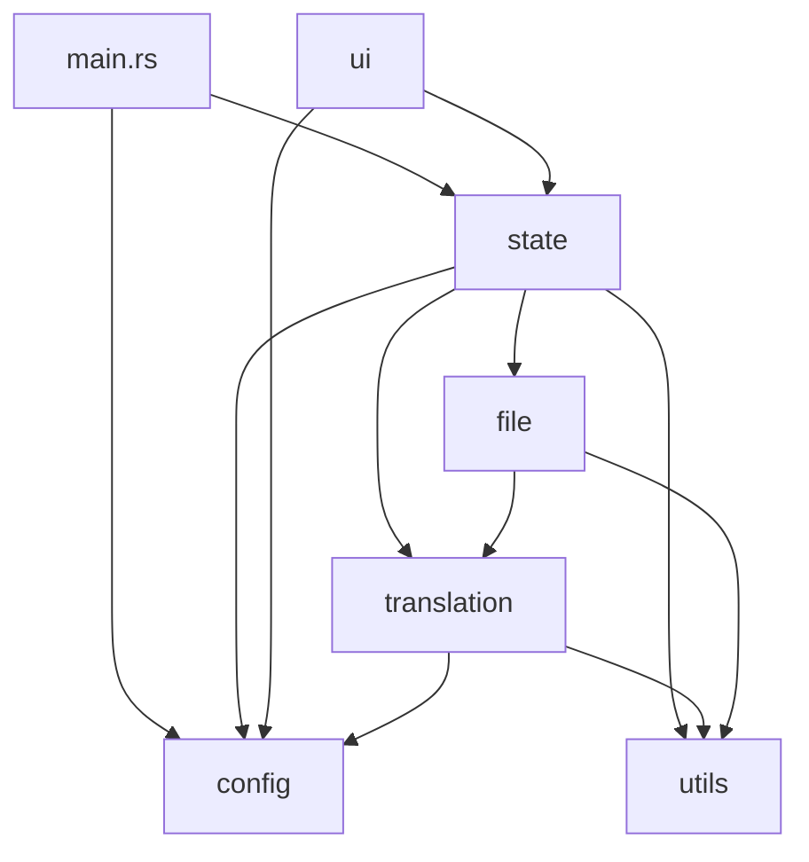

# 模組重構實施計畫 - Phase 6 到 Phase 7

基於 Phase 1 至 Phase 5 已完成的重構進度，以下是剩餘的 Phase 6（UI 模組）與 Phase 7（最終清理）實施計畫。

---

## 補強後的最終目錄結構

```
src/
├── lib.rs                        # 函式庫入口，統一匯出與向後相容
├── main.rs                       # 應用程式入口
│
├── config/                       ← 配置模組 [已完成]
│   ├── mod.rs
│   ├── settings.rs
│   ├── dictionary.rs
│   └── encryption.rs
│
├── state/                        ← 全域狀態模組 [已完成]
│   ├── mod.rs
│   ├── app_state.rs
│   ├── viewer_state.rs
│   └── actions.rs
│
├── translation/                  ← 翻譯核心模組 [已完成]
│   ├── mod.rs
│   ├── job.rs
│   ├── context.rs
│   ├── engine.rs
│   ├── batching.rs
│   ├── api/
│   │   ├── mod.rs
│   │   ├── client.rs
│   │   └── models.rs
│   └── glossary/
│       ├── mod.rs
│       ├── automaton.rs
│       ├── analyzer.rs
│       └── mc_lang.rs
│
├── file/                         ← 檔案處理模組 [已完成]
│   ├── mod.rs
│   ├── scanner.rs
│   ├── jar_handler.rs
│   ├── json_handler.rs
│   ├── js_handler.rs
│   ├── pipeline.rs
│   └── pack_gen.rs
│
├── ui/                           ← UI 模組 [Phase 6]
│   ├── mod.rs
│   ├── app.rs                    # eframe::App impl (update 主迴圈)
│   ├── theme.rs                  # render_theme_application
│   ├── constants.rs              # LABEL_COLOR_LIGHT, LABEL_COLOR_DARK
│   ├── components/
│   │   ├── mod.rs
│   │   ├── header.rs             # render_header_controls, render_status_navigation
│   │   ├── settings.rs           # render_settings_panel
│   │   ├── developer.rs          # render_developer_mode_panel
│   │   ├── progress.rs           # render_progress_section
│   │   ├── actions.rs            # render_action_buttons
│   │   └── log.rs                # render_log_area
│   ├── viewport/
│   │   ├── mod.rs
│   │   ├── manager.rs            # show_viewport_if_needed, create_viewport_deferred
│   │   ├── viewer_content.rs     # render_memory_viewer_content (主表格渲染)
│   │   └── dialogs.rs            # 新增/取代/清除 對話框邏輯
│   └── widgets/
│       ├── mod.rs
│       └── toggle.rs             # 自訂 Widget
│
└── utils/                        ← 工具模組 [已完成]
    ├── mod.rs
    ├── helpers.rs
    ├── text_processing.rs
    └── skip_rules.rs
```

---

## 跨模組依賴關係圖



> [!IMPORTANT]
> 依賴方向為**單向**：`ui → state → {config, translation, file, utils}`。
> 剩餘工作將完成最上層的 `ui` 模組以及最終的匯出清理。

---

## 各 Phase 詳細規劃

### Phase 6：`ui/` 模組（最上層）

#### [MODIFY] [ui.rs](file:///x:/D/MCTEST/mc_translator_rs/src/ui.rs) → 拆分為 12+ 個檔案

| 新檔案 | 估計來源行號 | 內容 |
|---|---|---|
| `ui/constants.rs` | L5-7 | `LABEL_COLOR_LIGHT`, `LABEL_COLOR_DARK` |
| `ui/app.rs` | L9-146 | `eframe::App` impl |
| `ui/theme.rs` | L329-421 | `render_theme_application` |
| `ui/components/header.rs` | L423-568 | `render_header_controls`, `render_status_navigation` |
| `ui/components/settings.rs` | L570-890 | `render_settings_panel` |
| `ui/components/developer.rs` | ~L891-980 | `render_developer_mode_panel` |
| `ui/components/progress.rs` | ~L980-1060 | `render_progress_section` |
| `ui/components/actions.rs` | ~L1060-1140 | `render_action_buttons` |
| `ui/components/log.rs` | ~L1140-1200 | `render_log_area` |
| `ui/viewport/manager.rs` | L148-327 | `show_viewport_if_needed`, `create_viewport_deferred` |
| `ui/viewport/viewer_content.rs` | ~L1200-1600 | `render_memory_viewer_content` |
| `ui/viewport/dialogs.rs` | ~L1600-1856 | 新增/取代/清除對話框 |

#### 遷移步驟
1. 建立 `src/ui/` 完整目錄結構。
2. 先抽出 `constants.rs`、`theme.rs`（零依賴）。
3. 逐一搬移各 `render_*` 方法。
4. Viewport 閉包函式較複雜，需額外注意 Arc 變數的捕獲。
5. 更新 `main.rs` 調用點。
6. `cargo check` → Git 提交。

---

### Phase 7：`lib.rs` 最終清理與向後相容

#### 步驟
1. 更新 `lib.rs` 匯出，移除已廢棄的舊路徑（若不再需要向後相容）。
2. 更新 `main.rs` 的 `use` 路徑，全面轉向模組化目錄。
3. 移除所有剩餘的舊頂層 `.rs` 檔案（如 `ui.rs`）。
4. 最終進行完整 Release 編譯。
5. Git 提交。

---

## 驗證方案

### 自動化驗證
- 每個階段後執行 `cargo check`。
- 最終完成後執行 `cargo build --release`。

### 手動驗證
1. **啟動應用程式**：確認主視窗正常顯示。
2. **功能測試**：切換主題、開啟建議詞管理器、設定 API、檔案選擇、開始翻譯。
