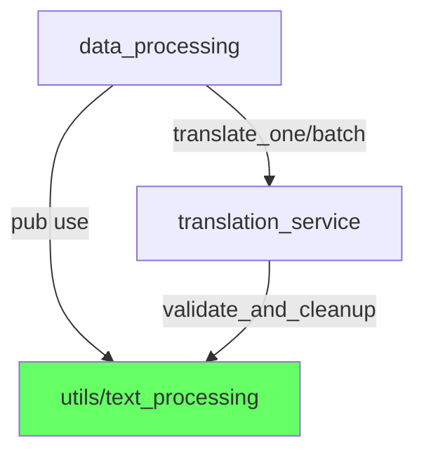

# 完成報告：模組重構 Phase 0-3 + 循環依賴解除

## Git 分支狀態

```
* refactor/break-circular-dep (1 commit)
  └── 解除 data_processing/translation_service 循環依賴

* refactor/module-restructure (3 commits)
  ├── Phase 1：拆分 utils/
  ├── Phase 2：拆分 config/
  └── Phase 3：建立 translation/ re-export 層
```

---

## 循環依賴解除 ✅

### 問題


### 解法

提取 5 個純文本處理函式至 `utils/text_processing.rs`（不依賴任何一方）：

| 函式 | 用途 |
|---|---|
| `validate_and_cleanup` | 清理 LLM 回傳（移除 Markdown、引號、前綴） |
| `detect_loop` | 偵測翻譯循環 |
| `preprocess_text` | 格式標記替換為預留位置 |
| `postprocess_text` | 還原預留位置 |
| `sync_formatting` | JSON 增量格式更新 |

### 修改檔案

| 檔案 | 變更 |
|---|---|
| [text_processing.rs](file:///x:/D/MCTEST/mc_translator_rs/src/utils/text_processing.rs) | **[NEW]** 284 行，5 函式 + `PLACEHOLDER_RE` |
| [data_processing.rs](file:///x:/D/MCTEST/mc_translator_rs/src/data_processing.rs) | 1123→852 行，移除函式改為 `pub use` re-export |
| [translation_service.rs](file:///x:/D/MCTEST/mc_translator_rs/src/translation_service.rs) | 3 處改用 `crate::utils::text_processing::` |
| [utils/mod.rs](file:///x:/D/MCTEST/mc_translator_rs/src/utils/mod.rs) | 新增 `pub mod text_processing` |

### 依賴方向（修正後）



### 驗證

`cargo check` 通過，0 錯誤 0 警告。
